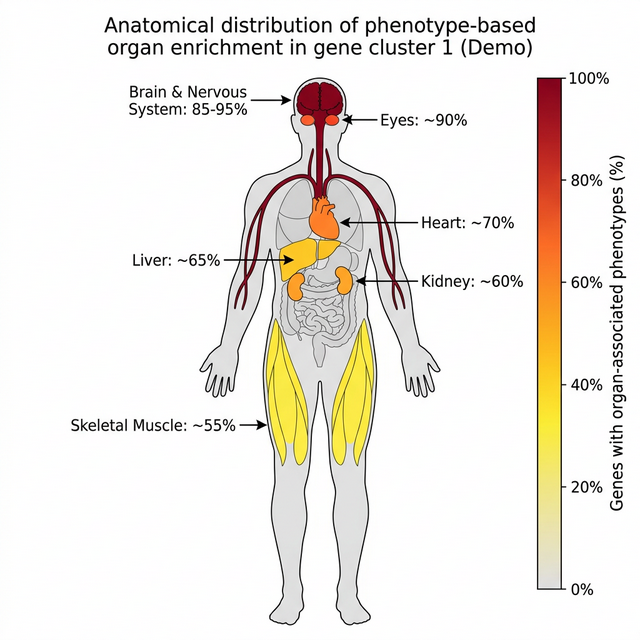

# IRD HPO Anatomogram

  

*Shalev Yaacov — Translating gene module phenotype signatures into anatomical body maps
for clinical and non-computational audiences.*

---

## Overview

Computational clustering of IRD genes produces modules with rich phenotypic
structure — but a similarity matrix or network graph is not a figure a clinician
can act on directly. This project provides the visualization layer that bridges
that gap: it takes a gene module as input, maps its HPO phenotype annotations to
anatomical organ systems, and renders a color-coded anatomogram of the human body
showing which organs the module's phenotype burden concentrates on.

The pipeline was built as a downstream complement to the IRD Phenotype Clustering
project and runs on any gene clustering output that provides gene → HPO → module
assignments.

---

## Rationale

The output of a phenotypic clustering step — a set of gene modules, each with a
list of significantly enriched HPO terms — is precise but not immediately
interpretable by clinical collaborators. A clinician looking at a list of HPO term
IDs or a similarity heatmap cannot quickly assess whether a module reflects
primarily retinal, neurological, or systemic disease. An anatomogram solves this:
organ systems are colored by the fraction of module genes with at least one
phenotype mapping to that organ, producing a figure readable in seconds by anyone
with a clinical background.

The non-trivial step is the mapping from HPO terms to organ systems. HPO terms are
fine-grained and highly specific — a term such as *Rod-cone dystrophy* does not
name an organ; it sits several levels down a directed acyclic graph whose
ancestors eventually reach anatomical categories. Correct mapping requires
traversing the HPO ontology hierarchy upward from each term to the nearest
organ-level ancestor, not a simple string lookup. The full pipeline uses BFS over
the `is_a` DAG via `pronto`; the demo approximates this with keyword matching on
term names to remain fully self-contained.

The broader point this project illustrates is not the anatomogram library itself
but the translation step: taking structured output from one computational layer
(phenotypic modules with HPO signatures) and converting it into a representation
that a different audience — clinical geneticists, genetic counselors — can engage
with directly. Designing that translation correctly, including identifying where
the mapping is ambiguous or lossy, requires understanding both the biology and the
structure of the ontology.

---

## Workflow

1. **Load input** — synthetic gene × HPO × module annotation table.
2. **HPO → organ mapping** — each HPO term name is matched to anatomical organ
   keys via keyword lookup (demo) or DAG traversal (full pipeline).
3. **Per-module aggregation** — for each module × organ pair, compute the
   percentage of genes in the module with at least one phenotype mapping to that
   organ: `value = (genes with organ phenotype / module size) × 100`.
4. **Write output CSV** — `gganatogram_organs_input_DEMO.csv` with columns
   `module_id, organ, value`, ready for the R visualization step.
5. **Anatomogram rendering** — `gganatomogram_Plot.Rmd` joins the organ percentages
   onto the full human anatomy, renders a color-mapped figure, and exports PNG,
   PDF, and TIFF.

---

## Files

```
IRD_HPO_Anatomogram/
├── README.md
├── data/
│   ├── gene_hpo_module_DEMO.csv          Synthetic gene–HPO–module input
│   ├── HPO_Organ_Label_Mapping.csv        gganatogram organ keys → labels
│   └── gganatogram_organs_input_DEMO.csv  Output of demo notebook (organ × %)
├── scripts/
│   ├── hpo_organ_mapping_demo.ipynb      Steps 1–4: mapping + aggregation
│   └── gganatomogram_Plot.Rmd            Step 5: anatomogram figure
└── outputs/
    └── demo/
        └── module_1_cluster1_demo.png    Example output (synthetic data)
```



---

## Input & Output

**Input:** `data/gene_hpo_module_DEMO.csv` — a synthetic table with columns
`gene_symbol`, `entrez_id`, `module_id`, `hpo_id`, `hpo_name`. Contains 3
fabricated modules (neurological/retinal, metabolic/visceral, cardiac/muscular)
with fabricated gene names (`GENE_A1`…`GENE_C5`) and real HPO term IDs drawn
from publicly available ontology data.

**Intermediate:** `data/gganatogram_organs_input_DEMO.csv` — written by the demo
notebook; columns `module_id, organ, value`. Consumed directly by the R script.

**Output:** one PNG/PDF/TIFF anatomogram per module, with organs colored by
phenotype burden (grey = 0 %, dark red = 100 %).

---

## Example Usage

```bash
# Step 1 — run the mapping notebook
jupyter notebook scripts/hpo_organ_mapping_demo.ipynb

# Step 2 — render the anatomogram (RStudio)
# Open scripts/gganatomogram_Plot.Rmd, set MODULE_ID to 1, 2, or 3, and knit.
```

> The demo notebook requires only `pandas` and runs without any ontology file.
> The full pipeline additionally requires `pronto` and `hp.obo`
> (available from [hpo.jax.org/data/ontology](https://hpo.jax.org/data/ontology)).

---

## Dependencies

```
# Python
pandas

# R
ggplot2, dplyr, readr, scales, ggrepel
devtools::install_github("jespermaag/gganatogram")
```

---

## Data & Privacy Disclaimer

> All gene names, entrez IDs, module assignments, and HPO term associations in
> this repository are entirely synthetic and fabricated. No real patient, clinical,
> or unpublished research data are included. HPO term IDs and names are drawn from
> the publicly available Human Phenotype Ontology.

---

*Part of the Evolutionary Genomics & Multi-Omics Portfolio.*
