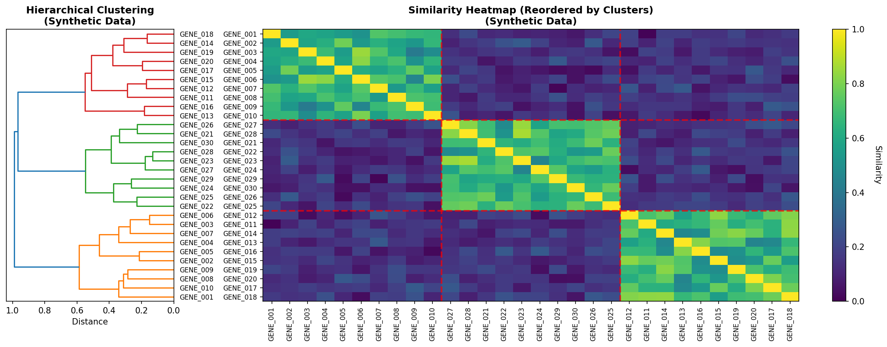

# **IRD Phenotype-Based Gene Clustering (Synthetic Demonstration)**

*A modular pipeline for phenotype-driven gene clustering using HPO semantic similarity — demonstrated entirely on synthetic data, designed for scalable multi-omics integration.*


---

## 🧬 **Overview**

This project demonstrates a **phenotype-based gene clustering pipeline** built around semantic similarity analysis using the **Human Phenotype Ontology (HPO)**.
The pipeline transforms raw gene lists into **phenotype-informed functional modules**, using:

* High-resolution HPO annotation,
* Resnik semantic similarity,
* Best Match Average (BMA),
* Rigorous IC-based term filtering,
* Multigraph network construction,
* Leiden community detection,
* Module stability & silhouette evaluation.

This public repository provides a **synthetic demonstration** of the workflow.
The full internal pipeline is designed to expand into **multi-omics module integration** (phenotype + evolution + expression + interaction networks).

---

## 🔬 **Scientific Background**

Inherited Retinal Diseases (IRD) involve hundreds of genes with substantial phenotypic heterogeneity.
While these genes vary genetically, they often converge into **shared phenotypic modules**, reflecting common biological mechanisms (e.g., ciliary dysfunction, phototransduction defects).

The Human Phenotype Ontology (HPO) enables:

* Standardized representation of clinical phenotypes,
* Mapping genes to phenotype profiles,
* Computing semantic similarity between genes.

Semantic similarity provides a complementary lens to evolutionary co-profiling (NPP/LPP), laying the foundation for a unified **multi-omics module discovery platform**.

---

## 🧱 **Pipeline Structure (High-Level)**

```
ird-phenotype-clustering/
├── notebook/
│   └── IRD_phenotype_Clustering_Pipeline.ipynb
├── data/
│   ├── raw/        # Place input files here
│   └── processed/  # Intermediate matrices & annotations
└── outputs/        # Final clusters, diagnostics, demo figures
```

This repository contains a self-contained synthetic demonstration of the complete workflow.

---

# ⚙️ **Pipeline Methodology**

The pipeline is modular and progresses through three main phases:

---

## ➤ **Stage 1 — HPO Annotation & Baseline Similarity**

### **1. Gene Normalization**

* Applies strict gene-symbol standardization
* Eliminates ambiguous mappings
* Produces a stable master list for downstream annotation

### **2. HPO Annotation Extraction**

* Maps genes to phenotype terms using the HPO annotation database
* Multiple identifier-based rescue mechanisms ensure high annotation coverage
* Outputs:

  * Gene → HPO term table (long)
  * Summary annotation table
  * Binary gene–HPO matrix

### **3. Baseline Semantic Similarity**

* Computes **Information Content (IC)** per HPO term
* Calculates:

  * **Resnik term–term similarity**
  * **BMA gene–gene similarity**
* Produces the initial gene–gene similarity matrix.

This stage establishes the raw semantic landscape used for refinement.

---

## ➤ **Stage 1.5 — IC Rebuild & High-Specificity Filtering**

A refined semantic similarity computation designed to enhance signal resolution.

### Key Improvements:

* Removal of **overly general** HPO terms (top ontology levels)
* Filtering low-information-content terms
* Recomputing IC using frequency-based scoring
* Reconstructing term–term and gene–gene similarity matrices with improved selectivity

### Result:

A sparse, high-specificity gene–gene similarity matrix better suited for module detection.

---

## ➤ **Stage 2 — Graph-Based Phenotype Module Discovery**

This stage replaces simple clustering with a **network-theoretic modular analysis**.

### **1. Multigraph Construction**

Two complementary topologies are generated:

* **k-NN graphs** (local topology preservation)
* **Threshold graphs** (high-confidence global structure)

The pipeline systematically tests multiple k-values and threshold percentiles.

### **2. Community Detection (Leiden Algorithm)**

* Leiden ensures well-connected, high-modularity communities
* Applied across all graph variants
* Best-performing configuration selected for downstream analysis

### **3. Module Quality Metrics**

Each module is evaluated via:

* **Silhouette scores** (cohesion, separation)
* **Stability under perturbation** (robustness to noise)
* **Internal/external similarity**

### **4. Core/Peripheral Gene Classification**

Each gene receives one of:

* **Core** — stable, highly coherent module members
* **Peripheral** — biologically related but less cohesive
* **Unassigned** — insufficient evidence to join a module

---

## 📈 **Workflow Demonstration (Synthetic Data)**

This repository includes synthetic examples illustrating the pipeline's core steps.

> **Figure — Example phenotype-similarity heatmap** *(synthetic demonstration)*
> 

These figures represent the analytical flow only — no real IRD or phenotype data are used.

---

## 🧪 **Future Directions — Toward Multi-Omics Module Integration**

This HPO-based module discovery workflow forms the **phenotypic layer** of a broader integrative platform.

The complete internal pipeline (not included here) is designed to merge:

* **Evolutionary modules** (NPP/LPP)
* **Phenotype modules** (HPO similarity)
* **Expression clusters**
* **Interaction networks**
* **Functional annotations**

The long-term goal is a **multi-omics modular architecture** for IRD and ciliopathies, where each layer reinforces and validates biological mechanisms uncovered by others.

---

## 🖥️ **How to Run the Demo**

```bash
jupyter notebook notebook/IRD_phenotype_Clustering_Pipeline.ipynb
```

Run cells sequentially to reproduce:

* Annotation extraction
* IC filtering
* Semantic similarity matrices
* Graph construction
* Module detection
* Quality scoring
* Synthetic visualizations

---

## 📁 **Key Outputs (Demo)**

### **Data Files**

* Gene master list (normalized)
* HPO annotation tables
* Term–term and gene–gene similarity matrices
* Module assignments (core/peripheral/unassigned)

### **Visualizations**

* Similarity heatmaps
* Module projections (PCA/UMAP)
* Silhouette scores
* Module stability plots

### **Reports**

* Module summaries
* QC diagnostics
* Execution logs

All outputs included here are **synthetic and demonstration-only**.

---

## 🧠 Key Methodological Insights

- Semantic similarity provides a complementary dimension to evolutionary profiling by capturing phenotypic convergence across IRD genes.
- IC-based filtering is essential for removing overly general phenotype terms that inflate similarity scores and obscure true modules.
- Graph-based community detection (Leiden) outperforms hierarchical clustering for complex similarity landscapes by producing well-connected modules.
- Module stability and silhouette scoring are critical for distinguishing robust biological signals from noise.
- The framework is intentionally modular, enabling future integration with additional omics layers (e.g., evolutionary NPP clusters, transcriptomics, PPI networks).
- All results shown here are synthetic; the internal research workflow includes additional heuristics and data layers not shared publicly.

---

## 🎯 Summary

- Synthetic demonstration of an HPO-based phenotype clustering pipeline.  
- Implements gene normalization, annotation extraction, IC filtering, and BMA semantic similarity.  
- Includes graph-based community detection (Leiden) and robust module QC (silhouette, stability).  
- Designed as the phenotypic layer of a broader multi-omics modular analysis framework.  
- All data in this repository are synthetic and provided for demonstration purposes only.

---

# ⚠️ **Data & Privacy Disclaimer**

> **This repository contains synthetic demonstration data only.**
> No real IRD, phenotype, or similarity data are included.
> The internal research pipeline uses confidential datasets not provided here.

---

*This project is part of the Evolutionary Genomics & Multi-Omics Portfolio.*
