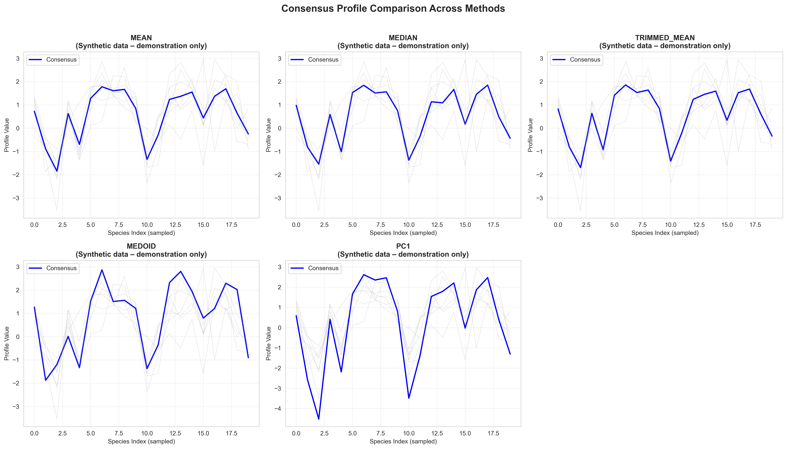

# **Consensus Phylogenetic Profile Analysis – Synthetic Demo**

### 🧬 Benchmarking Consensus-Based Evolutionary Gene Ranking

**Shalev Yaacov** | M.Sc. Researcher @ Hebrew University (Tabach Lab)
*A complete synthetic demonstration of consensus phylogenetic profiling, co-evolutionary ranking, and coherence validation across multiple statistical methods.*

---

## 📌 Overview

This project demonstrates a full consensus-based phylogenetic profiling workflow using **synthetic but structurally realistic data**. It showcases the computational logic behind identifying genes that co-evolve with an input gene set using:

* A two-level matrix architecture (full matrix + coherent species subset)
* A synthetic 7-gene “barcode” segment - 'LBS'
* Five consensus vector strategies
* Genome-wide correlation search (20,000 genes)
* Dual correlation metrics (Pearson & Spearman)
* Quantitative coherence validation
* Noise-based negative control

The methodology mirrors real large-scale evolutionary analyses while remaining safe for public use.

---

## 🔬 Scientific Background

Phylogenetic profiling identifies functionally related genes by analyzing their co-evolution across species. Genes involved in the same biological pathway tend to share similar phylogenetic presence/absence or normalized signal profiles.

**Consensus phylogenetic profiling** enhances this by:

* Aggregating multiple gene profiles into a unified vector
* Reducing noise and gene-specific variance
* Increasing ranking stability in large search spaces
* Providing interpretable evolutionary signatures

This synthetic demo models the real workflow used to discover novel gene candidates, validate evolutionary modules, and evaluate functional coherence.

---

## 🧱 Synthetic Data Architecture (Two-Level Structure)

A realistic, structured evolutionary dataset is simulated:

### **1. Full Synthetic NPP Matrix (20,000 × 1,900)**

* 50 functional blocks (400 genes each)
* Within-block correlation 0.3–0.8
* Clustered species patterns
* Noise added for realism
* Represents the full genome-wide search space

### **2. Species Subset (~400 species)**

Replicates real-world heatmap-based species selection:

* Synthetic similarity clustering
* 8 phylogenetic species clusters
* Top 400 species selected
* Ensures phylogenetic coherence and reduces noise

### **3. Synthetic 7-Gene Segment (7 × 400)**

* Extracted from a strongly correlated block
* Serves as the foundation for consensus profiling
* Preserves intra-module coherence

### **4. Correlation Search Restriction**

Correlation is computed **only across the 400 selected species**, matching real methodology and avoiding artifacts from distantly related species.

---

## ⚙️ Pipeline Methodology (Chronological)

### **Step 1 — Synthetic Data Generation**

Structured NPP matrix with functional blocks, phylogenetic species clusters, and noise.
Creates a controlled environment for benchmarking consensus strategies.

---

### **Step 2 — Species Subset Selection**

Synthetic similarity scores simulate how phylogenetic heatmaps identify coherent evolutionary regions.

---

### **Step 3 — Segment Extraction**

As part of the broader profiling framework I developed, an LBS (“Local evolutionary barcode segment”) represents a short evolutionary interval showing coherent conservation signals.  
In the real workflow, identifying such segments is guided by visual examination of phylogenetic heatmaps to locate regions that display consistent co-evolutionary behavior.  
A demonstration of this heatmap-based rationale appears in the **Heatmap Visualization** project.

> https://github.com/Shalev-CompBio/Shalev-Evolutionary-Genomics-Portfolio/tree/main/projects/heatmap_visualization
> 
> Figure: Example phylogenetic heatmap used to guide LBS selection
> 
> 
> **LBS Segment (Synthetic Demonstration):**  
> In this public synthetic demonstration, the LBS is represented by a structured 7-gene synthetic block designed to emulate the properties of such coherent evolutionary intervals.  
> An automated computational module for detecting LBS regions is currently under development and will be integrated into the full evolutionary profiling pipeline.

---

## 🔢 Step 4 — Consensus Profile Generation (Five Methods)

Each method aggregates the 7 gene profiles differently, revealing how method choice affects downstream ranking.

### 1. **Mean**

Captures the average signal; sensitive to outliers.

### 2. **Median**

Robust to extreme values; highlights central tendency.

### 3. **Trimmed Mean**

Removes one highest and lowest value per species; balances robustness and sensitivity.

### 4. **Medoid**

Selects the most representative single gene profile based on correlation-distance.

### 5. **PC1 (Principal Component 1)**

Extracts the dominant co-evolutionary pattern across all input genes.

**Why compare methods?**
Different consensus strategies emphasize different aspects of co-evolving genes. Comparing them reveals the most stable and interpretable approach for module detection.

---

> **Figure — Visual comparison of the five consensus profiling methods** *(synthetic demo)*
> This figure illustrates how the five consensus strategies (Mean, Median, Trimmed Mean, Medoid, PC1) aggregate the same 7-gene LBS segment.  
> Individual gene profiles are shown in light gray, and the resulting consensus vector is highlighted in color.  
> The comparison demonstrates how each method captures different aspects of the shared evolutionary signal and differs in robustness to noise and outlier patterns.  
>  
> 

---

## 📈 Step 5 — Correlation-Based Genome-Wide Ranking

For each consensus vector:

* Compute correlations against ~20,000 genes
* Restrict analysis to the 400 coherent species
* Run both Pearson (linear) and Spearman (rank-order)
* Rank genes by absolute correlation strength

This identifies genes with evolutionarily similar trajectories.

---

## 📊 Step 6 — Coherence Validation

To verify the biological plausibility of top-ranked genes:

1. Extract top 50 / 100 / 200 genes
2. Compute all pairwise correlations
3. Quantify mean absolute coherence
4. Compare across consensus methods and metrics

High coherence indicates true evolutionary module structure.

---

## 🚫 Step 7 — Negative Control (Noise-Based)

A randomized 7-gene segment is used to demonstrate:

* Consensus built from noise collapses
* Rankings lack internal coherence
* Coherence validation correctly distinguishes signal from randomness

This is essential to confirm methodological correctness.

---

## 🚀 Running the Demo

1. Install required packages (NumPy, Pandas, SciPy, scikit-learn, Seaborn, Matplotlib).
2. Launch Jupyter Notebook.
3. Open: `notebook/consensus_profile_demo.ipynb`
4. Run all cells.

**Runtime:** ~5–10 minutes
**RAM:** 4–8 GB recommended

---

## 📁 Output Files

### **Data (in `data/`)**

* `synthetic_segments.csv` – 7 × 400 segment
* `synthetic_full_matrix.csv` – 1,000 × 1,900 sample (full matrix held in memory)

### **Figures (in `outputs/demo_figures/`)**

* Segment heatmap
* Consensus comparison plot
* Coherence validation bars
* Correlation distribution histograms
* Signal vs. noise coherence comparison

All figures are labeled: *Synthetic data – demonstration only*.

---

## 📉 Visualizations

### 1. **Segment Heatmap**

Shows structure and correlation of the 7-gene module.

### 2. **Consensus Comparison**

Illustrates differences among the five consensus methods.

### 3. **Coherence Validation**

Quantifies internal consistency across top-N sets.

### 4. **Correlation Distributions**

Pearson vs. Spearman comparison.

### 5. **Signal vs. Noise**

Demonstrates collapse of coherence under noise.

---

## 🧠 Key Methodological Insights

* Two-level matrix design mirrors real-world workflows
* Species restriction is essential for noise reduction
* Different consensus methods highlight different signal dimensions
* Coherence validation is a robust diagnostic tool
* Negative control confirms methodological soundness

---

## 🎯 Summary

This synthetic demonstration implements a complete consensus phylogenetic profiling pipeline:

* Full NPP generation
* Species subset extraction
* Five consensus strategies
* Genome-wide correlation ranking
* Pearson + Spearman evaluation
* Quantitative coherence validation
* Noise-based control

It accurately reflects the computational logic behind real phylogenetic profiling analyses while remaining fully synthetic and portfolio-safe.

---

## 📚 References

* Pellegrini et al., *Nature* (1999) — Foundational phylogenetic profiling
* Standard PCA and consensus aggregation methodologies

---

## ⚠️ Data & Privacy Disclaimer

> **All data used in this project are fully synthetic and included solely for demonstration.**
**No real genomic, evolutionary, or disease-related datasets are used.**

Synthetic data emulate realistic evolutionary patterns while ensuring full confidentiality and portfolio suitability.

---

*This project is part of the Evolutionary Genomics & Multi-Omics Portfolio.*

